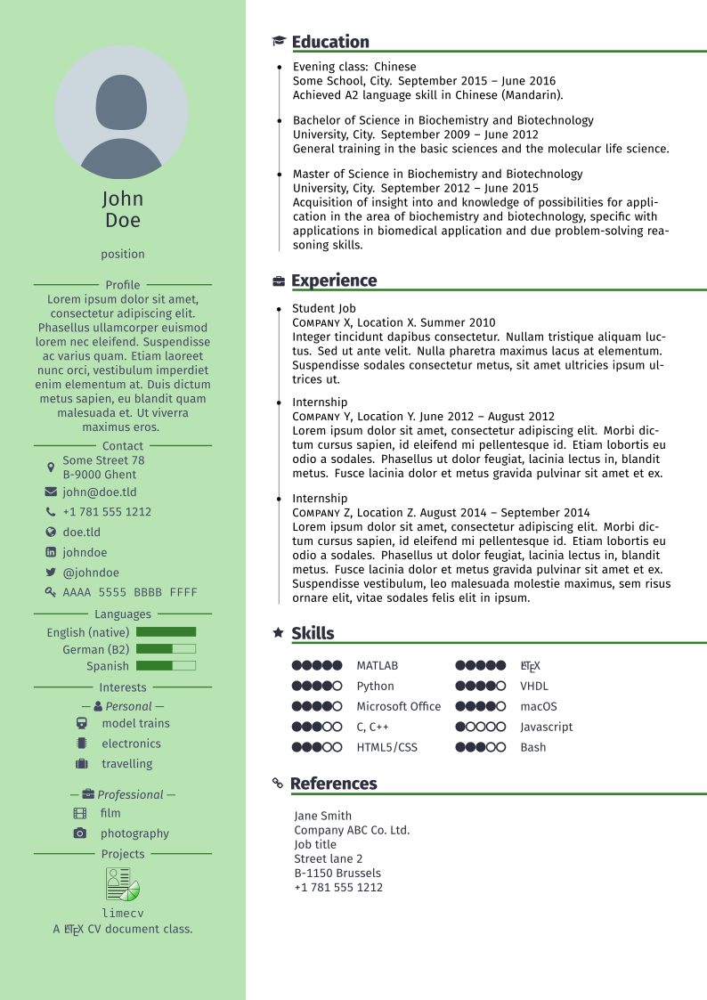

# limecv 

`limecv` is a document class to typeset curriculum vitæ in (Xe/Lua)LaTeX.

The design of this document class is detailed in [a series of blog posts][blog].  

Example CV:

  
  

`limecv` offers support for a bio/profile, contact details, language skills, (general) skills, projects, education, experience and references. It also features a custom cover letter design. 

## Installation

The package is [available from CTAN](https://ctan.org/pkg/limecv), so you should use a package manager to install this package.

After installing this package, make sure you have the following fonts installed:

* [FontAwesome][FA]
* [Fira][fira] (only needed when using XeLaTeX/LuaLaTeX)

The required packages are all available on CTAN. `support/install_texlive.sh` list all of them.

## Documentation

The class documentation can be found on [CTAN](http://ctan.org/tex-archive/macros/latex/contrib/limecv/limecv.pdf).

Alternatively, the documentation can also be created by running `xelatex limecv.dtx`.

## Examples

To compile the examples in `/examples/`, install the package from CTAN or compile from source by running: `xelatex limecv.ins` and copy the resulting `limecv.cls` file to the `/examples/` folder.

## Licence

LPPL v1.3c See LICENSE file.

Default profile picture courtesy of Twitter. 

© 2017 - 2020 Olivier Pieters

[blog]: https://olivierpieters.be/blog/archive/tag/limecv
[FA]: http://fontawesome.io
[fira]: https://github.com/mozilla/Fira
